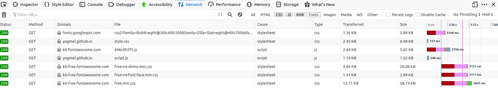

# Javascript III

## Conceitos básicos
## Protocolo HTTP
- [Uma visão geral do HTTP](https://developer.mozilla.org/pt-BR/docs/Web/HTTP/Overview);

HTTP é um protocolo que faz a conexão entre um receptor, normalmente o navegador (_browser_) e um servidor. Ela é a base da transferência de dados na Web.

Quando um site é acessado, seu navegador envia uma solicitação (_request_) para o servidor onde ele está hospedado. Este, por sua vez, envia uma resposta (_respose_) com o resultado dessa solicitação.


Por exemplo, ao chamar um script, uma folha de estilo ou uma imagem, é feita uma requisição para cada um desses recursos.



### Anatomia de uma Requisição HTTP


- Método HTTP, verbo como GET, POST, PUT, DELETE. As requisições para pegar e mostrar dados normalmente são feitas através de GET. Os demais verbos podem ser usados para modificar dados do servidor ou banco de dados;
- Origem e porta da requisição e caminho do arquivo solicitado;
- Versão do protocolo HTTP;
- Cabeçalhos (_header_) com informações para os servidor;
- Corpo (_body_) que são necessários para algumas requisições POST.

### Anatomia de uma Resposta HTTP


- Versão do protocolo HTTP que o servidor segue;
- Código de status (veja referências abaixo);
- Cabeçalhos (_header_) com informações vindas do servidor;
- Corpo (_body_) com dados solicitados, se houver.


**Código de Status das Respostas**
- [HTTP Statuses](https://httpstatuses.com/)
- [HTTP Dogs](https://httpstatusdogs.com/)
- [HTTP Cats](https://http.cat/)

### JSON
JSON é a abreviação de JavaScript Object Notation ou Notação de Objeto Javascript. É uma sintaxe para armazenar e tranferir dados. Trata-se de uma **string** que se parece bastante com um **objeto** Javascript.

```json
[
  {
    "nome": "Mellina",
    "idade": 21,
    "profissão": "desenvolvedora"
  },
  {
    "nome": "Joana",
    "idade": 12,
    "profissão": "criança"
  }
]
```

Nota-se que as propriedades, no JSON, necessariamente tem que estar entre `""`.

#### JSON.parse()
- Manipulando dados no formato json (conversão / navegação pela estrutura)


## API
[Open APIs](https://github.com/public-apis/public-apis)
- Conceito de API
- Acessando dados de APIs
- O que é CORS?


## Métodos de Array
- map / reduce / filter / foreach

## Requisições
- XMLHttpRequest
- Promises
- async e await
- Fetch

## Autenticação